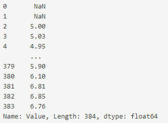
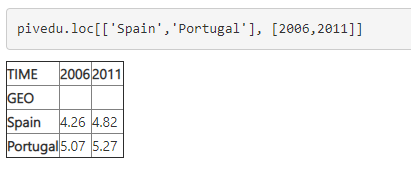

# PANDAS EN LA NUBE

* Primero tenemos que importar las librerias que vamos a necesitar


```
import pandas as pd 
import numpy as np 
import matplotlib.pyplot as plt
```

* tenemos que agregar la base de datos que vamos a ocupar con el comando csv

```
edu = pd.read_csv('https://github.com/DataScienceUB/introduction-datascience-python-book/blob/master/files/ch02/educ_figdp_1_Data.csv', na_values=':', usecols=['TIME', 'GEO', 'INDIC_ED','Value', 'Flagand Footnotes']) 
edu
```

* como la base de datos esta muy grande, ocupamos el metodo head(), este solo imprimira los primeros datos de la base de datos.


* para mostrar los ultimos datos de la base de datos se utiliza tail()


* para poder sacar algunos datos estadisticos como la media, el minimo, el maximo, etc.  se utiliza describe()


* Si vamos a ocupar solamente un subconjunto de la base de datos es necesario poner corchetes y comillas simples.

* para seleccionar un sbuconjunto de filas lo podemos hacer sperando con dos puntos entre los corchetes. Si solo se necesita una posicion o rango en especifico se indicaentre los puntos 


* si necesitamos un rango utilizando los nombres de los encabezados se utiliza iloc[]


* Si queremos filtrar cierto tipo de datos le podemos agregar un valor para que muestren solo lo de la condicion como la siguiente.


* Para saber si hay filas con valores faltantes utilizamos el metodo isnull()


## ALGUNAS FUNCIONES ARITMETICAS SON:

* MAXIMO 


* MAXIMO EN UNA COLUMNA DETERMINADA


Podemos aplicar cualquier operación aritmética binaria a una fila completa.

* DIVISION 


* RAIZ CUADRADA 


* CUADRADO DE UN VALOR UTILIZANDO LAMBDA 


Tambien podemos asignar el valor de una operacion a una columna determinda, si se selecciona una columna ya puesta esta sustituira los valores que ya tiene por los nuevo valores.


* Para poder eliminar una columna se utiliza el metodo drop()


* Para insertar una nueva fila se utiliza el metodo append


* Para eliminar la ultima fila utilizamos el metodo dropagain, es decir drop(), utilizando ciertas especificaciones


* Para eliminar una fila que no tenga valors se utiliza el metodo dropna()


* Para llenar las filas que no tiene valor pordemos utilizar el metodo fillna()


* Ordenar por columnas sort_values()


* Para ver la base de datos original se utiliza sort_index()


* Podemos agrupar las columnas como nosotros lo deseemos 
    groupby().mean() 


* Reorganizar todo nuestros datos es facil, solo necesitamos filtrarlos y posteriormente girarlos 


* Seleccionar filas especificas pivedu.loc[]




ALUMNA : LUISA MARIA OLAYA ALVAREZ
201768068
